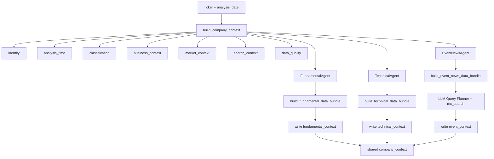

# Company Context Design

## 背景

当前项目已经从“每个 Agent 各自构造输入”的方式，演进到引入统一共享上下文 `company_context` 的架构。

`company_context` 的目标不是保存所有原始数据，而是作为：

- 同一标的在同一分析时点的统一语义底座
- 多个 Agent 可复用的共享输入
- 各分析 Agent 收敛结果的统一写回位置

它解决的核心问题有三个：

1. 各 Agent 不再重复猜测“这家公司是什么”
2. 各 Agent 在同一组身份、时间、分类和业务语义上工作，减少结论漂移
3. 上层 Research / Strategy Agent 可以直接消费结构化中间结果，而不是重新理解多个孤立报告


## 设计理念

只有“跨多个 Agent 都有复用价值、且在同一分析时点应保持一致”的信息，才应该进入共享 context。

这意味着：

- 应该放入：
  - 标的身份
  - 时间口径
  - 分类信息
  - 业务语义
  - 市场语义
  - 各分析 Agent 的结构化收敛结果
- 不应该放入：
  - 全量行情原始表
  - 三张报表原始表
  - 全量新闻标题列表
  - LLM 原始推理链

换句话说，`company_context` 是“统一语义与收敛结果容器”，不是“数据缓存大表”。


## 顶层架构

当前推荐且已实现的顶层结构如下：

```json
{
  "identity": {},
  "analysis_time": {},
  "classification": {},
  "business_context": {},
  "market_context": {},
  "technical_context": {},
  "fundamental_context": {},
  "event_context": {},
  "search_context": {},
  "data_quality": {}
}
```

代码定义见：

- [company_context.py](/Users/wysong/Documents/workspace/fintech/TradingAgentProMax/TradingAgents/tradingagents/dataflows/company_context.py)
- [company_context_service.py](/Users/wysong/Documents/workspace/fintech/TradingAgentProMax/TradingAgents/tradingagents/dataflows/company_context_service.py)


## 字段定义

### `identity`

统一标的身份信息。

当前字段：

- `ticker`
- `company_name`
- `exchange`
- `market`

作用：

- 作为所有 Agent 的统一标的入口
- 避免每个 Agent 各自重复查股票简称和市场信息


### `analysis_time`

统一时间口径。

当前字段：

- `requested_date`
- `effective_date`
- `date_mode`

说明：

- `date_mode = natural_day` 主要给 `EventNewsAgent`
- `date_mode = trade_day` 主要给 `TechnicalAgent` 和 `FundamentalAgent`

作用：

- 解决自然日和交易日口径混乱问题
- 让 bundle 构建时能够显式复用已有时间基准


### `classification`

统一分类信息。

当前字段：

- `industry`
- `company_type`
- `style_tag`
- `size_bucket`
- `liquidity_bucket`

作用：

- 所有 Agent 共享同一套行业和风格信息
- 避免一个 Agent 把公司视作周期股，而另一个按成长股逻辑解释


### `business_context`

共享业务语义层。

当前字段：

- `sub_industry`
- `business_model`
- `company_intro`
- `core_products`
- `main_business_items`
- `demand_drivers`
- `cost_drivers`
- `policy_drivers`
- `global_risk_drivers`

当前实现状态：

- 已填充：
  - `sub_industry`
  - `business_model`
  - `company_intro`
  - `core_products`
  - `main_business_items`
- 预留待增强：
  - `demand_drivers`
  - `cost_drivers`
  - `policy_drivers`
  - `global_risk_drivers`

作用：

- 给 `EventNewsAgent` 生成更贴公司语义的 query
- 给 `FundamentalAgent` 提供业务理解背景
- 未来给 Strategy / Research Agent 提供统一的驱动变量视角

注意：

当前 `business_context` 还偏“材料层”，后续应进一步收敛成“驱动变量层”。


### `market_context`

共享市场风格层。

当前字段：

- `valuation_style`
- `market_attention_points`
- `trading_sensitivity`

当前实现状态：

- `valuation_style` 已根据 `company_type` 初步生成
- `market_attention_points` / `trading_sensitivity` 仍为空列表，后续可由 Agent 或规则层补充

作用：

- 描述市场如何看待该公司
- 为上层决策节点提供风格背景


### `technical_context`

`TechnicalAgent` 的写回区。

当前字段：

- `trend`
- `momentum`
- `volatility`
- `volume_confirmation`
- `relative_strength`
- `technical_compact_signals`
- `key_levels`
- `signals`
- `confidence`
- `technical_summary_zh`

作用：

- 把技术分析结果沉淀回共享 context
- 供上层 Agent 直接消费，不必重新读取技术报告


### `fundamental_context`

`FundamentalAgent` 的写回区。

当前字段：

- `company_profile`
- `growth`
- `profitability`
- `cashflow_quality`
- `balance_sheet_health`
- `valuation`
- `fundamental_compact_signals`
- `financial_snapshot`
- `core_risks`
- `fundamental_signals`
- `confidence`
- `fundamental_summary_zh`

作用：

- 把基本面分析结果沉淀回共享 context
- 形成统一的慢变量判断层


### `event_context`

`EventNewsAgent` 的写回区。

当前字段：

- `event_overview`
- `event_compact_signals`
- `event_context_snapshot`
- `event_chain`
- `key_catalysts`
- `key_risks`
- `tracking_points`
- `confidence`
- `event_summary_zh`

作用：

- 把事件/新闻分析结果沉淀回共享 context
- 让上层 Agent 直接消费事件链，而不是重新检索新闻


### `search_context`

检索语义层。

当前字段：

- `search_aliases`
- `seed_titles`
- `ths_member_codes`
- `ths_concepts`
- `index_memberships`
- `preferred_query_style`
- `language_bias`

作用：

- 为 Query Planner 提供更贴财经语境的检索词
- 保留板块、概念、行业层级和别名信息

当前实现状态：

- 已接入：
  - `ths_member`
  - 本地持久化 THS 板块映射
  - `index_member_all`
- 已开始过滤宽基噪声：
  - `同花顺全A`
  - `主板`
  - `大盘`
  - `高动量`
  - `高盈利`
  - `近期新高`
  等

注意：

`ths_concepts` 当前还是“主题化后的概念列表”，不是最终高纯度检索关键词，后续还需要继续精炼。


### `data_quality`

统一描述共享 context 的完整性和来源。

当前字段：

- `missing_sections`
- `stale_sections`
- `source_summary`

作用：

- 让后续 Agent 能识别哪些上下文缺失
- 避免把“无数据”误判为“无事件/无风险/无观点”


## 数据来源

当前 `company_context` 的基础构建主要来自 Tushare。

### 已接入的数据源

- `stock_basic`
  - 公司简称、行业、市场、上市日期
- `stock_company`
  - 公司介绍、主营业务
- `fina_mainbz`
  - 主营业务构成
- `ths_member`
  - 个股所属同花顺板块代码
- 本地持久化 THS 映射
  - `ths_index_mapping.json`
- `index_member_all`
  - 行业层级关系
- `daily_basic`
  - 市值、换手率，用于推导市场风格相关信息


## 构建流程

统一入口：

- [build_company_context()](/Users/wysong/Documents/workspace/fintech/TradingAgentProMax/TradingAgents/tradingagents/dataflows/company_context_service.py)

当前构建流程：

1. 标准化 `ticker`
2. 读取 `stock_basic`
3. 识别 `company_type`
4. 根据 `date_mode` 统一时间口径
5. 通过 `build_event_query_context()` 汇总：
   - 公司介绍
   - 主营业务
   - 板块概念
   - 行业关系
6. 组装：
   - `identity`
   - `analysis_time`
   - `classification`
   - `business_context`
   - `search_context`
   - `data_quality`
7. 用 `daily_basic` 轻量补充 `market_context`


## 与各个 Agent 的结合方式

### FundamentalAgent

文件：

- [fundamental_agent.py](/Users/wysong/Documents/workspace/fintech/TradingAgentProMax/TradingAgents/tradingagents/agents/fundamental/fundamental_agent.py)
- [fundamental_bundle_service.py](/Users/wysong/Documents/workspace/fintech/TradingAgentProMax/TradingAgents/tradingagents/dataflows/fundamental_bundle_service.py)

当前结合方式：

1. `analyze(..., company_context=None)` 支持传入共享 context
2. 不传时自动构建 `company_context(date_mode="trade_day")`
3. bundle 构建时复用：
   - `identity`
   - `classification`
   - `business_context`
4. bundle `meta` 中显式带出：
   - `sub_industry`
   - `business_model`
5. 分析结束后把结果写回：
   - `fundamental_context`


### TechnicalAgent

文件：

- [technical_agent.py](/Users/wysong/Documents/workspace/fintech/TradingAgentProMax/TradingAgents/tradingagents/agents/technical/technical_agent.py)
- [technical_bundle_service.py](/Users/wysong/Documents/workspace/fintech/TradingAgentProMax/TradingAgents/tradingagents/dataflows/technical_bundle_service.py)

当前结合方式：

1. `analyze(..., company_context=None)` 支持传入共享 context
2. 不传时自动构建 `company_context(date_mode="trade_day")`
3. bundle 构建时复用：
   - `identity`
   - `classification`
   - `business_context`
4. bundle `meta` 中显式带出：
   - `sub_industry`
   - `business_model`
5. 分析结束后把结果写回：
   - `technical_context`


### EventNewsAgent

文件：

- [event_news_agent.py](/Users/wysong/Documents/workspace/fintech/TradingAgentProMax/TradingAgents/tradingagents/agents/event_news/event_news_agent.py)
- [event_news_bundle_service.py](/Users/wysong/Documents/workspace/fintech/TradingAgentProMax/TradingAgents/tradingagents/dataflows/event_news_bundle_service.py)

当前结合方式：

1. `analyze(..., company_context=None)` 支持传入共享 context
2. 不传时自动构建 `company_context(date_mode="natural_day")`
3. bundle 构建时直接围绕共享 context 组织 planner 输入
4. Query Planner 重点消费：
   - `classification`
   - `business_context`
   - `search_context`
5. 分析结束后把结果写回：
   - `event_context`


## 当前架构图




## 当前实现边界

当前共享 context 已经具备系统级雏形，但还不是最终形态。

### 已完成

- 统一顶层 schema 已定义
- `company_context` 已由数据层构建
- 三个 Agent 已支持读取同一份 `company_context`
- 三个 Agent 已支持把各自结果写回 `company_context`
- `Technical/Fundamental` bundle 已围绕 `company_context` 统一 `meta`
- `search_context.ths_concepts` 已开始过滤宽基噪声

### 尚未完成

#### 1. `business_context` 仍偏材料层

当前还没有稳定补齐：

- `demand_drivers`
- `cost_drivers`
- `policy_drivers`
- `global_risk_drivers`

后续应把 `business_context` 从“描述材料”收敛成“驱动变量层”。

#### 2. `search_context` 仍需进一步精炼

虽然已过滤宽基噪声，但仍可能残留：

- 地域类概念
- 融资融券
- 减持计划
- 其他非主题型词

后续应继续清洗，使其更接近“高检索价值主题词”。

#### 3. bundle 仍是三套专用数据视图

当前已经实现：

- bundle 读取共享 `company_context`
- 分析结果写回共享 `company_context`

但长期目标应进一步演进为：

- `company_context` 成为中心
- `technical/fundamental/event bundle` 成为围绕它展开的专用视图


## 使用建议

推荐的调用顺序：

1. 先构建 `company_context`
2. 先跑 `FundamentalAgent` 和 `TechnicalAgent`
3. 再把更新后的 `company_context` 传给 `EventNewsAgent`
4. 最终让上层 Strategy / Research Agent 直接消费整份 `company_context`

示意：

```python
ctx = build_company_context("601872.SH", "2026-03-29", date_mode="natural_day")

fund = FundamentalAgent().analyze("601872.SH", "2026-03-29", company_context=ctx)
ctx = fund["company_context"]

tech = TechnicalAgent().analyze("601872.SH", "2026-03-29", company_context=ctx)
ctx = tech["company_context"]

event = EventNewsAgent().analyze("601872.SH", "2026-03-29", company_context=ctx)
ctx = event["company_context"]
```


## 后续迭代建议

优先级建议如下：

1. 把 `business_context` 收敛成驱动变量层
2. 继续精炼 `search_context`
3. 让上层 `Strategy Decision Agent` 直接消费 `company_context`
4. 统一更多 bundle 与 `company_context` 的关系，减少语义重复构建


## 一句话总结

`company_context` 当前已经成为项目中技术、基本面、事件三个分析 Agent 的共享语义底座。它统一了承载身份、时间、分类、业务、市场和检索语义的信息，并为各 Agent 提供稳定输入与结果写回位置；后续演进的重点不再是“是否需要共享 context”，而是“如何继续把它从结构雏形收敛成真正的系统主干”。
