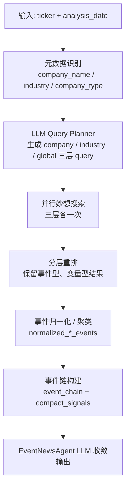

# EventNewsAgent 设计文档

## 1. 定位

`EventNewsAgent` 不是一个新闻摘要器，而是一个面向 A 股事件驱动研究的事件检索、事件归一化和事件链收敛节点。

它的核心目标不是回答“最近有哪些新闻”，而是回答：

- 发生了什么关键事件
- 这些事件影响了哪些变量
- 这些变量作用在公司、行业还是全球层面
- 这些影响能否拼成一条可分析的事件传导链

对上层 Agent 而言，它提供的应该是：

- 公司层事件
- 行业层变量变化
- 全球层触发因素
- 三层之间的传导路径
- 当前缺失的证据链


## 2. 设计原则

### 2.1 输入极简

对外输入只保留：

- `ticker`
- `analysis_date`

其余上下文由数据层自动补全。

### 2.2 LLM 负责生成 query，不负责臆造事实

检索 query 继续由 LLM 生成，而不是完全退化成硬编码规则。

原因：

- 不同行业、不同公司、不同事件敏感变量不同
- query 质量直接决定召回质量
- LLM 更适合根据 `company_name / industry / company_type` 自适应生成检索语句

### 2.3 脚本负责稳定性和结构化

在检索之后，脚本负责：

- 分层重排
- 事件归一化
- 聚类去重
- 事件链构建
- compact signals 生成

原因：

- 这些步骤需要稳定、可复现、可评估
- 不适合完全交给 LLM 自由发挥

### 2.4 最终输出面向上层 Agent，不面向“写得像报告”

最终输出不是新闻长文，而是结构化事件结果与事件链。


## 3. 总体架构




## 4. 输入

### 4.1 对外输入

```json
{
  "ticker": "601872.SH",
  "analysis_date": "2026-03-29"
}
```

### 4.2 内部上下文

在进入 query planner 前，系统会补足：

```json
{
  "ticker": "601872.SH",
  "company_name": "招商轮船",
  "analysis_date": "2026-03-29",
  "industry": "水运",
  "company_type": "utilities_transport_infrastructure",
  "business_hint": null
}
```

说明：

- 当前 `analysis_date` 保留自然日，不归一化到交易日
- `business_hint` 当前允许为空，后续可由上层 Agent 提供增强上下文


## 5. Query Planner

### 5.1 作用

`EventQueryPlanner` 的职责是：

- 识别公司敏感变量
- 为公司层、行业层、全球层各生成 1 条高质量检索 query
- 为后续检索提供最小但有效的召回入口

### 5.2 输出

```json
{
  "sensitivity_variables": [],
  "company_query": "",
  "industry_query": "",
  "global_event_query": "",
  "query_rationale": {
    "company": "",
    "industry": "",
    "global": ""
  }
}
```

### 5.3 三层 query 的设计目标

#### 公司层

用于检索公司硬事件，例如：

- 业绩
- 订单/项目
- 资本运作
- 监管/诉讼
- 重大经营变化

#### 行业层

用于检索中观变量变化，而不是泛行业新闻。重点关注：

- 政策
- 供给
- 需求
- 价格/景气
- 库存/资本开支
- 技术/竞争格局

#### 全球层

用于检索全球触发因素与传导变量。必须同时覆盖：

- 触发因素：地缘、OPEC、美元指数、关税、航运、商品价格
- 传导变量：供给、价格、运价、保险、库存、成本、汇率


## 6. 数据源与检索层

### 6.1 元数据来源

当前通过 `Tushare stock_basic` 获取：

- `name`
- `industry`
- `market`
- `list_date`

### 6.2 新闻与事件搜索来源

当前通过东方财富妙想搜索 `mx_search` 获取资讯。

三层搜索当前均为：

- 每层 1 条 query
- 每层 1 次妙想搜索
- 三层并行执行

### 6.3 并行执行

公司层、行业层、全球层检索通过线程池并行执行，以降低总耗时。


## 7. 重排层

妙想原始返回不能直接使用，必须按层重排。

### 7.1 公司层重排

优先保留：

- 业绩
- 订单/合同
- 资本运作
- 监管/诉讼
- 重大经营动作

降权：

- 基金持仓
- ETF 导流
- 盘前要闻
- 复盘类内容

### 7.2 行业层重排

优先保留：

- 政策变化
- 供给变化
- 需求变化
- 价格/景气变化
- 库存/资本开支变化
- 技术/竞争格局变化

### 7.3 全球层重排

优先保留：

- 同时命中“全球触发因素”与“传导变量”的结果

例如：

- 霍尔木兹 + 原油 + 供给中断
- 红海 + 航运 + 运价 + 保险
- OPEC + 减产 + 原油价格


## 8. 事件归一化与聚类

### 8.1 目标

检索结果不能直接以新闻标题列表的形式交给上层 Agent。

需要先做：

- 维度识别
- 事件类型识别
- 重复标题聚类
- 重要性估计

### 8.2 当前中间对象

数据层会生成：

- `normalized_company_events`
- `normalized_industry_events`
- `normalized_global_events`

每个事件对象大致包含：

- `event_key`
- `layer`
- `event_type`
- `title`
- `direction`
- `importance`
- `time_horizon`
- `affected_variables`
- `dimensions`
- `evidence_titles`
- `summary`

### 8.3 设计价值

这一步的作用是：

- 压缩重复标题
- 让后续 LLM 面对的是事件对象，不是散乱标题
- 提高后续输出稳定性


## 9. 事件链构建

### 9.1 目标

把三层事件组织成上层 Agent 可消费的传导链，而不是孤立新闻列表。

### 9.2 输出结构

```json
{
  "event_chain": {
    "global_triggers": [],
    "industry_variables": [],
    "company_impacts": [],
    "missing_links": []
  }
}
```

### 9.3 字段含义

#### `global_triggers`

外部冲击起点，例如：

- 中东地缘冲突
- 红海危机
- OPEC 减产
- 美元指数变化

#### `industry_variables`

行业中观变量，例如：

- 景气度
- 运价
- 油价
- 库存
- 资本开支
- 供需格局

#### `company_impacts`

公司层实际影响，例如：

- 新船交付
- 订单签约
- 业绩兑现
- 融资压力
- 监管风险

#### `missing_links`

当前证据链缺失的环节，例如：

- 缺全球触发证据
- 缺行业运价数据
- 缺公司经营兑现证据

### 9.4 设计价值

这一步使上层 Agent 可以直接判断：

- 事件链是否闭环
- 缺失的是哪一段上下文
- 后续需要继续补什么信息


## 10. event_compact_signals

除了事件链，数据层还会生成一组紧凑状态字段：

```json
{
  "company_event_bias": "",
  "macro_event_bias": "",
  "event_density": "",
  "policy_sensitivity": "",
  "earnings_catalyst_state": "",
  "risk_event_level": ""
}
```

这些字段的作用是：

- 给上层 Agent 提供快速状态判断
- 避免每次都重新从标题列表抽象事件偏向


## 11. EventNewsAgent 最终收敛层

### 11.1 输入

最终 LLM 收到的事件数据包不只是原始新闻，还包括：

- `company_news`
- `macro_news`
- `normalized_company_events`
- `normalized_industry_events`
- `normalized_global_events`
- `event_chain`
- `event_compact_signals`

### 11.2 LLM 的职责

LLM 不再负责“从零发现事件”，而是：

- 在已有事件对象基础上做收敛
- 形成结构化输出
- 补充中文摘要

### 11.3 输出 schema

当前主输出包括：

- `event_overview`
- `company_specific_events`
- `industry_macro_events`
- `event_compact_signals`
- `event_chain`
- `key_catalysts`
- `key_risks`
- `tracking_points`
- `event_summary_zh`


## 12. 与原始 TradingAgents 的区别

### 原始 `news_analyst` / `social_media_analyst`

本质上是：

- 搜新闻
- 写长文报告
- 让后续 Agent 阅读

### 当前 `EventNewsAgent`

本质上是：

- 先用 LLM 规划检索
- 再分层检索
- 再重排
- 再归一化为事件对象
- 再构建事件链
- 最后 LLM 收敛输出

因此，它已经从：

**新闻摘要节点**

升级成：

**事件链分析节点**


## 13. 当前架构的优点

- 输入简单
- Query 生成具备行业适应性
- 三层搜索并行执行
- 检索后先结构化，再交给 LLM
- 能显式输出事件链和缺失证据
- 更适合接上层 `Researcher / Strategy Agent`


## 14. 当前架构的瓶颈

### 14.1 global query 质量仍会波动

某些行业和公司场景下，全球层仍可能召回不足。

### 14.2 行业层仍可能偏弱

行业层要真正强，可能需要更多结构化中观变量数据，而不仅是新闻。

### 14.3 数据源边界

妙想搜索更擅长中文财经资讯，但不一定稳定覆盖所有全球宏观触发场景。

### 14.4 聚类仍是第一版

当前是脚本化轻聚类，后续还可以增强语义聚类质量。


## 15. 后续迭代方向

建议优先顺序：

1. 按行业优化 `global_event_query` 与 `industry_query` prompt
2. 为特定行业补结构化变量源，例如运价、库存、资本开支等
3. 增强事件聚类键设计
4. 提升全球层来源过滤
5. 继续用评测脚本做批量回归


## 16. 一句话总结

当前 `EventNewsAgent` 的设计思想是：

**输入股票代码和自然日，先识别公司与行业，再由 LLM 生成公司层、行业层、全球层三条检索 query；对妙想检索结果做并行召回、分层重排、事件归一化与聚类，构建 global -> industry -> company 的事件传导链，最后由 LLM 输出结构化事件分析结果和中文摘要。**
