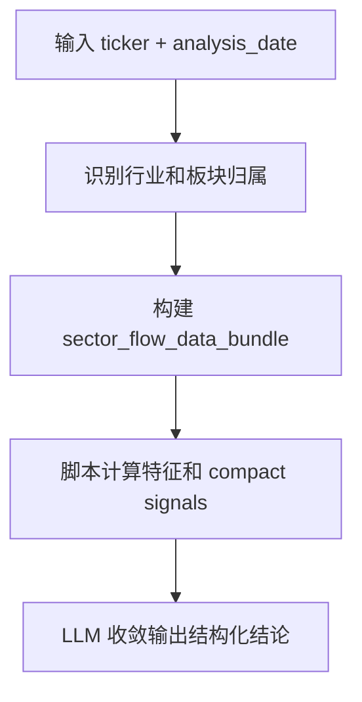

# SectorFlowAgent 设计文档

## 1. 设计目标

`SectorFlowAgent` 是一个面向 A 股板块资金面的独立分析节点。

它的目标不是判断价格趋势，也不是解释公司基本面，而是回答：

- 当前所属板块是否处于强势方向
- 板块热度是在升温、维持还是退潮
- 当前交易是否已经拥挤
- 个股在板块中是龙头、核心跟随还是边缘票
- 资金行为是否具有持续性

它给上层 Agent 提供的是：

- 板块强度
- 板块热度
- 交易拥挤度
- 个股板块角色
- 资金持续性


## 2. 输入

对外输入保持极简：

```json
{
  "ticker": "601872.SH",
  "analysis_date": "2026-03-29"
}
```

系统内部会补齐为：

```json
{
  "ticker": "601872.SH",
  "requested_date": "2026-03-29",
  "effective_trade_date": "2026-03-27",
  "sector_flow_data_bundle": {}
}
```

说明：

- 资金面数据按最近有效交易日处理
- 数据层会自动识别公司名称、行业、`company_type` 和申万行业归属


## 3. 输出

`SectorFlowAgent` 的输出是一个收敛后的结构化结果：

```json
{
  "ticker": "",
  "effective_trade_date": "",
  "theme_strength": {
    "state": "strong | moderate | weak",
    "summary": "",
    "evidence": []
  },
  "theme_heat": {
    "state": "hot | warm | cold",
    "summary": "",
    "evidence": []
  },
  "crowding": {
    "state": "low | medium | high",
    "summary": "",
    "evidence": []
  },
  "stock_role_in_theme": {
    "state": "leader | core_follower | peripheral | lagging",
    "summary": "",
    "evidence": []
  },
  "flow_persistence": {
    "state": "persistent | unstable | fading",
    "summary": "",
    "evidence": []
  },
  "sector_flow_compact_signals": {
    "theme_strength": "",
    "theme_heat": "",
    "crowding_level": "",
    "stock_role": "",
    "flow_persistence": "",
    "rotation_state": ""
  },
  "key_risks": [],
  "tracking_points": [],
  "flow_summary_zh": ""
}
```

其中：

- `theme_strength`：板块是否是当前强方向
- `theme_heat`：板块是否正在被市场活跃交易
- `crowding`：交易是否已经过热
- `stock_role_in_theme`：个股在板块中的相对地位
- `flow_persistence`：资金行为是否连续
- `sector_flow_compact_signals`：给上层 Agent 直接消费的收敛层


## 4. Agent 核心逻辑

整体逻辑分为四步：



### 4.1 板块归属识别

优先根据申万行业成分识别板块；如果缺失，再回退到 `stock_basic.industry`。

### 4.2 数据包构建

数据层从 `Tushare` 获取：

- 个股交易数据
- 个股资金流数据
- 板块日线数据
- 板块横截面数据
- 涨跌停与龙虎榜辅助数据

并构建：

- `stock_snapshot`
- `sector_snapshot`
- `relative_position`
- `theme_activity`
- `flow_features`

### 4.3 脚本生成收敛信号

脚本先生成 `sector_flow_compact_signals`，包括：

- `theme_strength`
- `theme_heat`
- `crowding_level`
- `stock_role`
- `flow_persistence`
- `rotation_state`

这一步的作用是先把核心板块资金面状态稳定下来，不依赖 LLM 自由发挥。

### 4.4 LLM 负责解释与收敛

LLM 不负责重新发明信号，只负责：

- 对结构化信号做解释
- 生成 `summary`
- 补足 `evidence`
- 生成 `flow_summary_zh`

这样可以兼顾：

- 脚本层的稳定性
- LLM 层的表达和归纳能力


## 5. 设计边界

`SectorFlowAgent` 明确不做：

- 技术趋势判断
- MACD / RSI / ATR 等技术指标分析
- 基本面质量分析
- 新闻事件总结

它和其他 Agent 的关系是：

- `TechnicalAgent`：价格行为
- `FundamentalAgent`：公司质量
- `EventNewsAgent`：事件与催化
- `SectorFlowAgent`：板块交易行为和资金结构

一句话总结：

`SectorFlowAgent` 负责回答“市场是否正在交易这条板块逻辑，以及这只股票在其中处于什么位置”。
