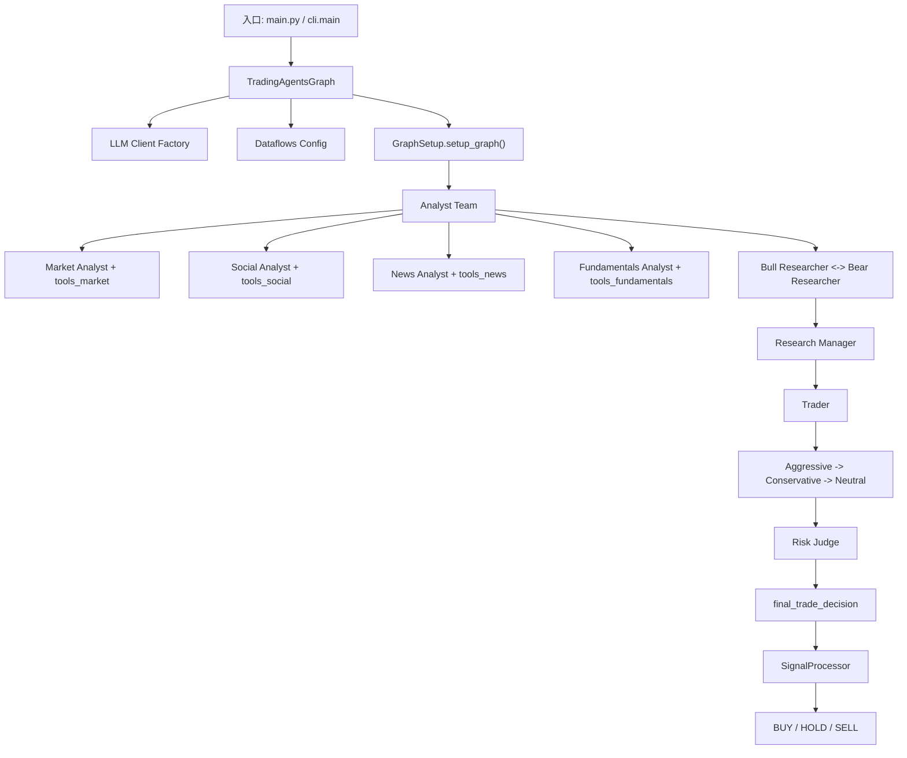

# TradingAgents 项目架构与设计思路

本文档用于给后续迭代提供统一上下文，重点说明当前仓库的模块边界、执行链路、核心状态，以及设计上刻意保留的扩展点和当前实现限制。

## 1. 项目定位

TradingAgents 是一个基于 LangGraph 的多 Agent 交易研究框架。它不是传统意义上的量化执行系统，而是一个把研究流程拆成多个角色的 LLM 协作系统：

- Analyst Team 负责采集和解释不同维度的信息。
- Research Team 负责多空辩论和投资建议收敛。
- Trader 负责把研究结论转成交易提案。
- Risk Team 负责从不同风险偏好视角继续辩论。
- Risk Judge / Portfolio Manager 负责给出最终交易决策。

当前代码主目标是生成一套可解释的研究和决策文本，而不是直接接入真实交易执行。

## 2. 总体架构

可以把系统拆成四层：

1. 编排层
   `tradingagents/graph/`
   负责图构建、状态初始化、节点跳转、最终信号提取、反思闭环。

2. 角色层
   `tradingagents/agents/`
   负责各类 agent 的 prompt、输入上下文拼接、输出落到 state 的方式。

3. 适配层
   `tradingagents/llm_clients/` 和 `tradingagents/dataflows/`
   负责把“模型调用”和“数据供应商调用”统一抽象成可切换接口。

4. 交互层
   `cli/`、`main.py`
   前者提供交互式 UI 和结果落盘，后者提供最小 Python 调用样例。

## 3. 目录与职责

### 3.1 `tradingagents/graph/`

- `trading_graph.py`
  系统总入口。负责初始化配置、LLM、memory、tool nodes，并暴露 `propagate()`、`reflect_and_remember()`、`process_signal()`。
- `setup.py`
  真正构建 LangGraph 工作流，定义节点和边。
- `propagation.py`
  初始化图状态，包括基础 report 字段和两类 debate state。
- `conditional_logic.py`
  决定 analyst 是否继续调用工具，以及两轮辩论何时停止。
- `signal_processing.py`
  用一个额外的 LLM 调用，从最终长文本里抽取 `BUY/HOLD/SELL`。
- `reflection.py`
  在知道收益/亏损后，对 bull、bear、trader、judge 等角色做复盘，并写入 memory。

### 3.2 `tradingagents/agents/`

- `analysts/`
  面向数据采集和初步分析。特点是都会 `bind_tools()`，先工具调用，再产出长文本报告。
- `researchers/`
  Bull/Bear 对 analyst 报告展开对抗式辩论。
- `managers/`
  `research_manager.py` 用于把多空辩论收敛成投资计划。
  `risk_manager.py` 用于把风险辩论收敛成最终决策。
- `trader/`
  把研究计划变成交易提案，并要求输出 `FINAL TRANSACTION PROPOSAL: **BUY/HOLD/SELL**`。
- `utils/`
  包含 tool 包装、state 类型定义、memory 实现等公共能力。

### 3.3 `tradingagents/dataflows/`

这一层是“数据供应商路由器”。上层 agent 不直接关心用的是 `yfinance` 还是 `alpha_vantage`。

- `config.py`
  保存运行时配置。
- `interface.py`
  根据 category-level / tool-level 配置，把调用路由到具体 vendor。
- `y_finance.py`、`yfinance_news.py`
  默认数据实现，覆盖价格、指标、基本面、新闻。
- `alpha_vantage_*`
  Alpha Vantage 对应实现。
- `stockstats_utils.py`
  技术指标的本地缓存和 stockstats 计算。

### 3.4 `tradingagents/llm_clients/`

这是“模型供应商工厂”：

- `factory.py`
  根据 `llm_provider` 选择 OpenAI / Google / Anthropic 的实现。
- `openai_client.py`
  兼容 OpenAI、xAI、OpenRouter、Ollama。
- `google_client.py`
  对 Gemini 输出做内容归一化。
- `anthropic_client.py`
  Anthropic 的简单封装。

设计上这一层把 provider 差异压平，让 graph 和 agents 只依赖统一的 chat model 接口。

### 3.5 `cli/`

CLI 是当前最完整的使用方式，承担了几个职责：

- 收集用户选择的 ticker、日期、模型、研究深度、参与 analyst。
- 绑定 `StatsCallbackHandler`，统计 LLM 和工具调用。
- 实时展示图执行过程、agent 状态和当前报告。
- 把阶段性报告和完整报告落盘到 `results_dir`。

## 4. 运行链路

### 4.1 初始化阶段

`TradingAgentsGraph` 在初始化时做了这些事：

1. 加载并注入 config。
2. 通过 `create_llm_client()` 初始化 `deep_thinking_llm` 和 `quick_thinking_llm`。
3. 为 bull、bear、trader、invest_judge、risk_manager 分别初始化 memory。
4. 创建按领域划分的 tool nodes。
5. 初始化 `ConditionalLogic`、`GraphSetup`、`Propagator`、`Reflector`、`SignalProcessor`。
6. 编译 LangGraph 得到最终工作流。

其中有一个明确的设计思路：

- quick model 用于 analyst、researcher、trader、risk debator 这类高频节点。
- deep model 用于 `Research Manager` 和 `Risk Judge` 这种负责最终收敛的节点。

这是一种典型的“高频便宜模型 + 关键路径强模型”的成本控制设计。

### 4.2 Analyst 阶段

Analyst 节点按顺序串行执行，顺序由 `selected_analysts` 决定：

- `market`
- `social`
- `news`
- `fundamentals`

每个 analyst 的工作模式都基本一致：

1. 从 state 中取当前 ticker 和 trade date。
2. 构造系统 prompt。
3. 使用 `llm.bind_tools(tools)`。
4. 如果模型发起 tool call，则进入对应 `tools_*` 节点。
5. 工具返回后重新回到 analyst。
6. 当没有 tool call 时，视为报告完成，写入对应 report 字段。
7. 通过一个 “Msg Clear” 节点删除旧消息，减少上下文污染后再进入下一个 analyst。

这里体现了两个设计意图：

- Analyst 与工具交互是闭环的，一个 analyst 只对自己那一组工具负责。
- 阶段之间显式清空消息，避免上一个 analyst 的对话上下文干扰下一个 analyst。

### 4.3 Research Debate 阶段

在 analyst 报告齐全后，系统进入 Bull/Bear 辩论：

- `Bull Researcher`
- `Bear Researcher`
- `Research Manager`

`ConditionalLogic.should_continue_debate()` 用 `count` 控制辩论轮数。默认逻辑是 bull 与 bear 来回发言，达到 `2 * max_debate_rounds` 后交给 `Research Manager` 收敛。

这一层不是简单投票，而是“对抗式推理 + judge 收敛”：

- Bull/Bear 各自读取 analyst 报告。
- 同时读取来自 memory 的历史相似场景反思。
- Research Manager 最后输出投资计划 `investment_plan`。

### 4.4 Trader 阶段

Trader 接收 `investment_plan`，再结合类似场景的历史记忆，输出 `trader_investment_plan`。

这个节点的角色不是重新做全量研究，而是把研究团队的结论转成更接近交易动作的提案。

### 4.5 Risk Debate 阶段

Trader 之后进入三方风险辩论：

- Aggressive Analyst
- Conservative Analyst
- Neutral Analyst

轮转顺序由 `ConditionalLogic.should_continue_risk_analysis()` 控制。达到 `3 * max_risk_discuss_rounds` 后进入 `Risk Judge`。

这一层的设计目的不是重复上一轮多空研究，而是从不同风险偏好重新审视 trader plan：

- Aggressive 偏向抓上行机会。
- Conservative 偏向控制回撤。
- Neutral 做平衡。
- Risk Judge 负责最终收敛成 `final_trade_decision`。

### 4.6 最终信号与日志

`propagate()` 返回两部分：

- `final_state`
- `process_signal(final_trade_decision)` 得到的方向标签

也就是说，系统的“最终输出”其实是两层：

- 一层是完整的、可解释的长文本决策。
- 一层是由额外 LLM 提取出的 `BUY/HOLD/SELL`。

同时，`TradingAgentsGraph` 会把关键状态写到 `eval_results/<ticker>/TradingAgentsStrategy_logs/`。

## 5. 核心状态设计

系统状态定义在 `agents/utils/agent_states.py`，核心是一个共享的 `AgentState`。

### 5.1 基础字段

- `company_of_interest`
- `trade_date`
- `messages`
- `sender`

### 5.2 Analyst 报告字段

- `market_report`
- `sentiment_report`
- `news_report`
- `fundamentals_report`

这四个字段是后续所有 researcher、trader、risk agent 的共同输入。

### 5.3 Investment Debate State

- `bull_history`
- `bear_history`
- `history`
- `current_response`
- `judge_decision`
- `count`

这是 Research Team 的中间态，主要解决两件事：

- 保留双边辩论轨迹。
- 让 manager 能在完整上下文上收敛。

### 5.4 Risk Debate State

- `aggressive_history`
- `conservative_history`
- `neutral_history`
- `history`
- `latest_speaker`
- `current_*_response`
- `judge_decision`
- `count`

这里相比 investment debate 多了 “最近说话人” 和三方各自最近一次响应，用来驱动三节点轮换。

## 6. 设计思路

### 6.1 用角色分工替代单一大 prompt

作者并没有让一个模型一次性完成“读数据 -> 分析 -> 辩论 -> 风险评估 -> 决策”，而是把流程拆成多个角色。好处是：

- 每个节点职责更单一，prompt 更容易维护。
- 输出结构天然分层，便于调试和回溯。
- 可以按角色替换模型、替换工具、裁剪节点。

### 6.2 用 LangGraph 表达有限状态工作流

项目不是简单链式调用，而是有条件分支和循环：

- analyst 可以多次工具调用再产出结果。
- bull/bear 会循环辩论。
- aggressive/conservative/neutral 会循环辩论。

LangGraph 在这里的价值，是把“多角色协作”从 prompt 编排提升到显式图结构。

### 6.3 用 memory 做轻量经验回放

当前 memory 不是向量数据库，而是 BM25 词法检索：

- 完全离线。
- 没有 embedding 成本。
- 没有 provider 绑定。

这是一种偏工程实用主义的设计。目的不是追求最强语义召回，而是用低成本机制把历史复盘重新喂回决策过程。

### 6.4 用适配层隔离底层依赖

无论是 LLM 还是数据供应商，都没有直接散落在业务逻辑里：

- agent 只看 tool 名称和 chat model。
- graph 只看统一工厂和统一工具节点。
- 供应商切换集中在 `llm_clients/` 和 `dataflows/`。

这为后续扩展提供了比较干净的边界。

## 7. 当前实现的现实约束

这些点不是 bug 列表，而是后续迭代时必须知道的现实边界。

### 7.1 更像“研究生成系统”，不是“交易执行系统”

README 提到 Portfolio Manager 和 simulated exchange，但当前仓库主路径里没有真正的订单管理、组合持仓、撮合执行或 broker 接口。最终结果仍然是文本决策加方向标签。

### 7.2 Social Analyst 实际上主要复用了新闻接口

`social_media_analyst.py` 当前只调用 `get_news()`。如果底层 vendor 是 yfinance，本质上拿到的是相关新闻流，而不是真实的 X/Reddit/Stocktwits 等社交媒体数据。

也就是说，“social” 更接近“舆情/相关新闻解读”，不是严格意义上的社交媒体管道。

### 7.3 最终 BUY/HOLD/SELL 依赖二次 LLM 抽取

`SignalProcessor` 不是结构化解析器，而是再调用一次 LLM 去提炼最终方向。这使得最终标签具备灵活性，但也引入额外模型不确定性。

### 7.4 Memory 目前只在进程内存活

`FinancialSituationMemory` 当前是纯内存 BM25 索引，没有磁盘持久化。只有当同一个 `TradingAgentsGraph` 实例持续存在并调用 `reflect_and_remember()` 时，记忆才会累积。

如果新开进程或新建 graph，memory 会丢失。

### 7.5 输出路径存在两套约定

- CLI 使用 `config["results_dir"]` 保存报告和日志。
- `TradingAgentsGraph._log_state()` 直接写死到 `eval_results/...`。

这意味着当前仓库的结果输出路径并不完全统一，后续如果要做批量实验或服务化，需要先收敛这套约定。

### 7.6 供应商 fallback 只覆盖部分失败场景

`dataflows/interface.py` 的 fallback 主要针对 `AlphaVantageRateLimitError`。如果是其他网络错误、数据格式错误或返回异常，不一定会自动切到备用 vendor。

### 7.7 依赖中已有 `backtrader`，但主链路未接入

仓库声明了 `backtrader` 依赖，但当前核心路径没有把它接入到 graph 输出之后的回测或执行流水线中。这说明作者可能有往策略验证/回测方向演进的意图，但目前尚未落地。

## 8. 最适合的后续迭代方向

如果后续要继续演进，这个项目最自然的改造方向有六类：

1. 结构化输出
   把 analyst、manager、risk judge 的结果从长文本升级成 Pydantic/JSON schema，减少二次解析和 prompt 漂移。

2. 持久化 memory
   让 reflection 结果可跨会话保存，并按 ticker、行业、事件类型做检索。

3. 真实社交数据接入
   给 social analyst 增加真正的社媒数据源，而不是继续复用新闻接口。

4. 组合与执行层
   在 `final_trade_decision` 之后接入仓位、风控阈值、订单执行或回测模块。

5. 统一实验输出
   统一 `results_dir`、`eval_results`、CLI report 保存规则，方便自动评测和复盘。

6. 更细粒度的供应商治理
   把 fallback 从“只处理速率限制”扩展成“按错误类型自动切换 vendor / retry / degrade”。

## 9. 一句话总结

TradingAgents 当前的核心价值不在于“已经形成完整自动交易闭环”，而在于它已经把研究驱动型交易流程拆成了一个可编排、可解释、可扩展的多 Agent 框架。后续任何迭代，最重要的是守住这三条主线：

- 角色职责要清晰。
- graph 状态要可追踪。
- 基础设施适配层要继续和领域逻辑解耦。
